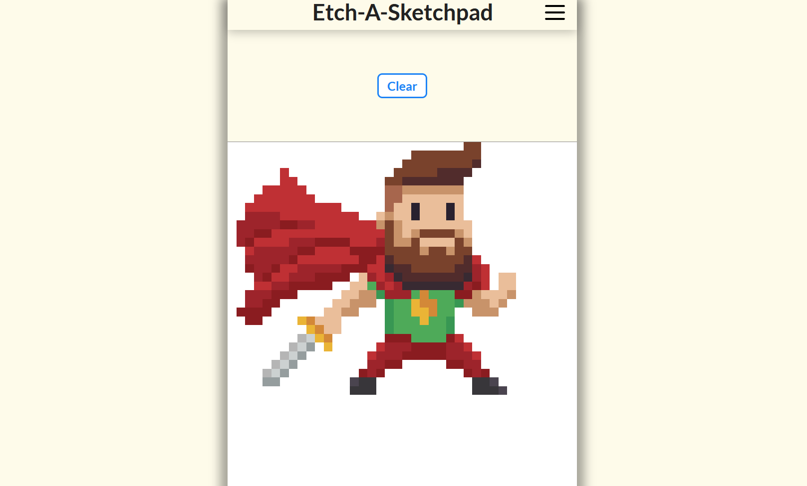
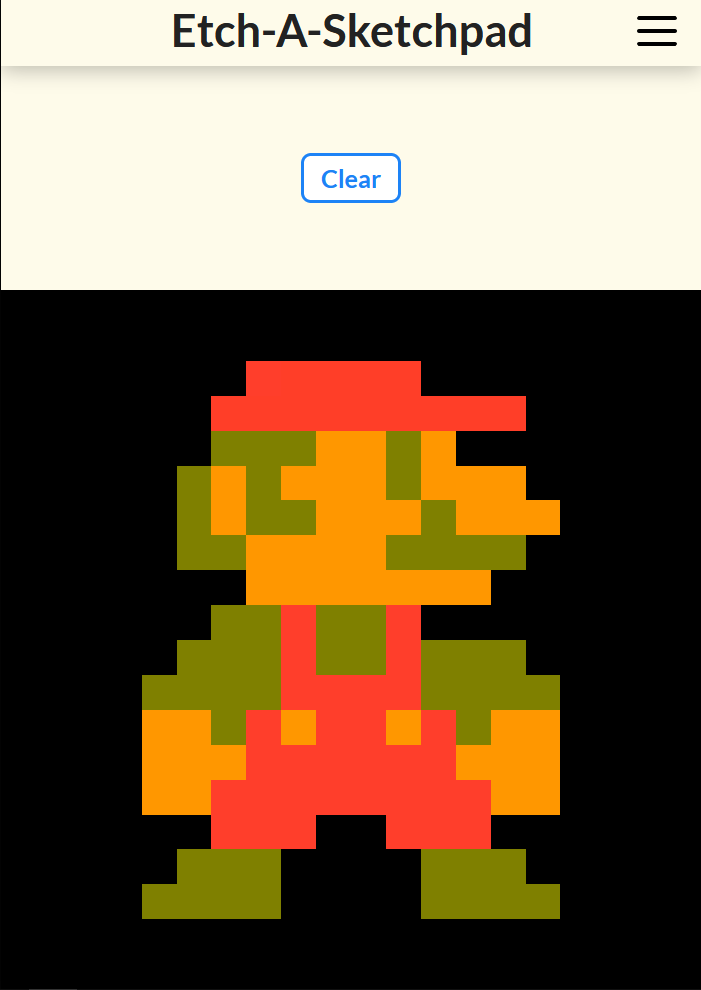

This project is a custom implementation of a sketchpad/Etch-a-Sketch.

**[Live Demo](https://cassoncode.github.io/etch-a-sketch/)** 

 

 

**TODO** 
* Organize/refactor app.js code
* Add/change/remove comments in app.js file
* Fix input color button alignment
