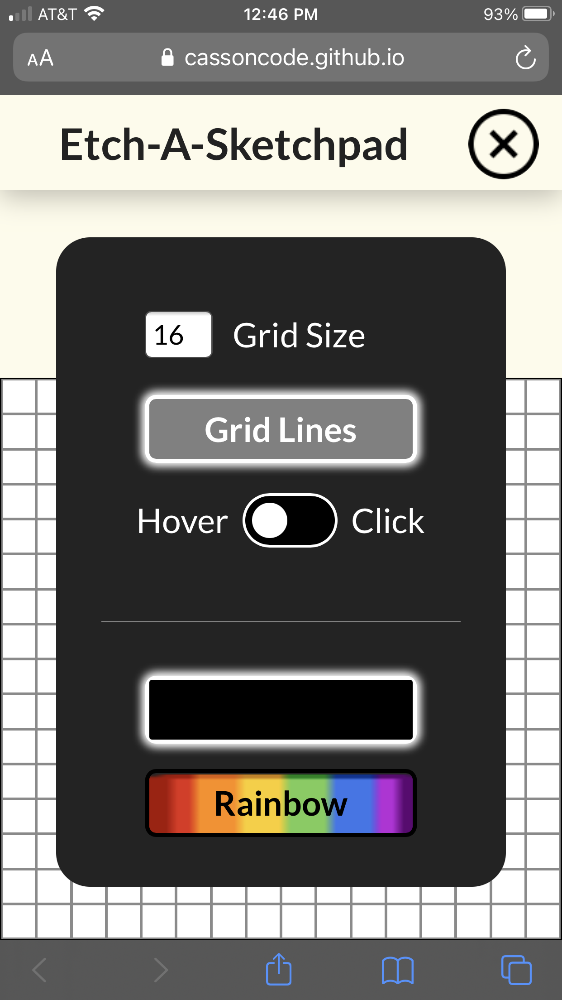

# Etch-A-Sketchpad
This project is a custom implementation of a sketchpad/Etch-a-Sketch.

**[Live Demo](https://ben-casson.github.io/etch-a-sketch/)** 

 

## Sample Images

 

## TODO
* Organize/refactor app.js code
* Add/change/remove comments in app.js file
* Make site responsive for large desktop screens and smaller tablets
* Replace 'hover' event listener with a 'drag' type event listener for mobile devices
